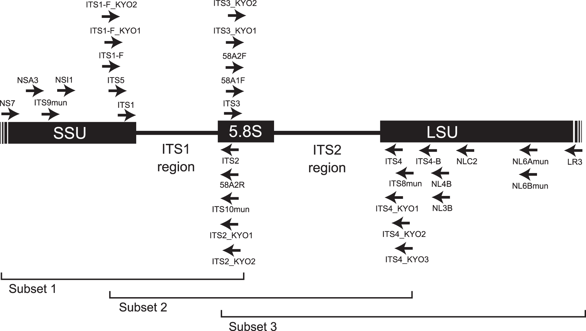

# Introduction

Some people collect coins, others stamps, still others baseball cards.
I happen to collect fungi because they taste good and have huge biosynthethic potential.

This paper describes my process creating high-fidelity Sanger sequences and select next-gen sequences for fungi in my collection.
It's a bit like slabbing coins: putting an unforgeable signature on legitimized goods.

I tuned the protocol variations toward Sanger sequencing's excellent short-read accuracy.
I also did as much of the sample processing myself to save money and ensure an attentive hand.

# Materials and methods

The malt extract came from Boston Homebrew Supply in Brookline, MA.
The yeast extract and peptone came from [add supplier] in [add city].

The DNA soil extract kit (740780.50) came from Machery-Nagel GmbH in Düren, Germany.
The agarose gel extract kit (D2510-01) came from Omega Bio-tek in Norcross, GA.

The primers came from Integrated DNA Technologies in Coralville, IA.
The pGreen plasmid came from Addgene in Watertown, MA.
The 1 kb DNA ladder and loading dye (N0550 and B7025) came from New England Biolabs in Ipswitch, MA.

Massachusetts General Hospital did the Sanger sequencing.

## Generating biomass for DNA extraction

I prepared 35 mL MYPB in a 50 mL Falcon tube for each sample (malt–yeast–peptone broth; 20 g/L malt extract and 1 g/L each yeast extract and peptone).
Then I fermented them for 14 days in a New Brunswick Innova 4000 Incubator Shaker ("shake 'n bake"; 250 RPM and 25 °C).
Discrete 3D colonies formed as the samples shook and book.

After two weeks I centrifuged the Falcon tubes for 20 min at 4,000 RPM and 25 °C in an Eppendorf 5810 R.
Then I collected 1.5 mL samples of the broth and metabolites for possible further analysis.
Mass spectrometry and thin-layer chromatography are two options, depending on equipment availability.

I poured off the remaining broth and stuffed the mycelium into 2 mL centrifuge tubes with an inoculation loop.
That was time consuming.
Then I centrifuged them for 10 min at 14,000 RPM in an Eppendorf 5415 C.

I pippetted out the supernatant, filled each tube with 750 μL normal saline (0.9% NaCl), vortexed them for 5s, then centrifuged them again.
I repeated this step 3×, vortexing and centrifuging until the samples were reasonably free of broth.

I transferred the washed pellets to fresh tubes and centrifuged them once more without added saline.
This removed any remaining liquid and helped prepare them for storage at –20 °C until I could perform the DNA extraction.
I weighed each pellet before freezing it, subtracting the 1.20g that an empty tube weighs.

The total biomass of each sample ranged from 330–2,060 mg ± 10 mg.

## Extracting DNA from the mycelium pellets

I extracted the DNA from 0.25–0.5g frozen mycelium samples using a NucleoSpin Soil purification kit.
I used lysis buffer SL1 without the enhancer SX and generally followed the [BosLab protocol annotations](documents/BosLab.v2.protocol.pdf).
Note that I performed the SB wash and the SW2 wash twice as in the original protocol.

I incubated 50 μL elution buffer, the recommended quantity for a medium-concentration extract, at 30 °C for 5 min.
There's a small but significant amount of room to optimize the extraction protocol.
The three most important deviations from the official protocol are, in my opinion,

- cooling down the bead tubes at –20 °C after vortexing them,
- centrifuging the collection tubes (green ring) somewhat longer after washing, and
- incubating the elution buffer somewhat longer and warmer, then centrifuging it longer.

During the test runs to determine the efficacy of lysis buffer SL1 vs. SL2, I got a feel for the protocol.
Note that even though I used SL1 throughout, some samples yielded radically more DNA than others.
This was apparently arbitrary and I achieved wildly different yields even within a genus.
For example, *H. abietis* vs. *H. coralloides* yielded 239.0 vs. 29.2 μg/mL, an 8-fold difference.

| 	|
| :--				|
| Primer map from https://dx.doi.org/10.1371%2Fjournal.pone.0097629 |

## Quantifying and amplifying the DNA extract

I ran a Qubit v1.27 fluorometer assay with 1 μL sample sizes and recalibrated the device each time I used it.
The positive control was a pGreen plasmid[^hellens2000] and the negative control was nuclease-free water.

The primer sequences are ITS 1F/ITS4 from the [Fungal Barcoding website developed by NIH/NLM/NCBI](http://www.fungalbarcoding.org/DefaultInfo.aspx?Page=Primers).
This website is down as of 28 May 2019 so please find the information below, supplemented with data from [NEB's Tm calculator](https://tmcalculator.neb.com).
I also used the NS7/LR3 primer pair for more comprehensive coverage of the surrounding gene region.

Note that while my culture library skews heavily toward basidiomycetes, I opted not to use the ITS4BR reverse primer.
The tradeoff was decreased specifity vs. being able to use the same primers for all samples in my collection.
This seems negligible because all the crude biomass comes from pure sources such as cultivated broth.

| Primer	| Sequence (5' → 3')			| Direction	| Bases	| % GC	| Tm (°C)	|
| :--		| :--					| :--:		| :--:	| :--:	| :--:			|
| ITS 1F	| `CTTGGTCATTTAGAGGAAGTAA`		| →		| 22	| 36	| 51			|
| ITS4		| `TCCTCCGCTTATTGATATGC`		| ←		| 20	| 45	| 54			|
| NS7		| `GAGGCAATAACAGGTCTGTGATGC`		| →		| 24	| 50	| 68			|
| LR3		| `CCGTGTTTCAAGACGGG`			| ←		| 17	| 59	| 64			|
| GFP-F		| `GGTCCTTCTTGAGTTTGTAAC`		| →		| 21	| 43	| 53			|
| GFP-R		| `CCATCTAATTCAACAAGAATTGGGACAAC`	| ←		| 29	| 38	| 58			|

I designed a PCR protocol based on [NEB's standard protocol](https://www.neb.com/protocols/0001/01/01/taq-dna-polymerase-with-standard-taq-buffer-m0273) and
[their PCR optimization guidelines](https://www.neb.com/tools-and-resources/usage-guidelines/guidelines-for-pcr-optimization-with-taq-dna-polymerase).
The content of each tube was, for a 50 μL reaction:

- 1 μL DNA extract
- 2 μL each primer at 10 μM
- 20 μL *Taq* 2× Master Mix
- 25 μL nuclease-free water

The Tm calculator helped me determine the annealing temperature and the expected 550 bp amplicon length determined the duration (assuming 1 kbp/s with *Taq* polymerase).
I used 25 cycles in an attempt to increase the data's fidelity without sacrificing the yield.

| Phase			| Time (s)	| Temperature (°C)	| Cycles	|
| :--			| :--:		| :--:			| :--:		|
| Denaturation I	| 60		| 95			| 1		|
| Denaturation II	| 30		| 95			| 25		|
| Annealing		| 		| 			| 		|
| 👉 ITS 1F/ITS4	| 30		| 46			| 25		|
| 👉 NS7/LR3		| 30		| 51			| 25		|
| Extension I		| 		| 			| 		|
| 👉 ITS 1F/ITS4	| 45		| 68			| 25		|
| 👉 NS7/LR3		| 90		| 68			| 25		|
| Extension II		| 300		| 68			| 1		|
| Cooling		| ∞		| 4			| nil		|

The thermocycler I used was an [add model].
Please see the run reports for each primer pair tested.

- [Veriti.Run.Report.ITS1F.ITS4.txt](documents/Veriti.Run.Report.ITS1F.ITS4.txt)
- [Veriti.Run.Report.NS7.LR3.txt](documents/Veriti.Run.Report.NS7.LR3.txt)

## Purifying PCR products from agarose gels

I used a miniPCR blueGel electrophoresis device because it's a low-voltage, low-reagent, non-UV system.
[Addgene's gel purification protocol](https://www.addgene.org/protocols/gel-purification/) informed the gel composition.
The gels contained 0.7% agarose and I cast them with a wide comb.

I prepared 4 gels with 60 mL buffer, 0.42g agarose, and 6 μL dye.
Each gel contained the following reagents.

- 15 mL 1× TAE buffer
- 0.105g agarose
- 1.5 μL GelGreen dye

todo:
The bands weren't great.
So I should PCR it again with half the volume and a high-fidelity master mix.
Then I can use double the normal amount in the gel.
This will really overload the beads or I can find another purification method.

Each well contained about 1 μg DNA determined by the quantified yield of the PCR product.
I also added 6× loading dye to each well: 20% of the amount of PCR product in the well.

## Preparing samples for sequencing

todo:
Probably a quick paragraph about diluting primers and adding purified DNA.
Maybe add a note about the yields required for the expected length.

| 	|
| :--				|
| The "Terrene" goat cheese |

# Results and discussion

The origins of my culture collection vary wildly.
Most came from trades with friends from the Shroomery online forum.
I don't trade with losers.
The *Ganodermas* came from Ryan Paul Gates via the Shroomery.

Those labelled "Mycoterra" came from Mycoterra Farm in South Deerfield, MA.
I collected those labelled "Cummington" myself at the Bryant Homestead in Cummington, MA.
The wild *G. frondosas* came from the Charles River Esplanade in Boston, MA and Fat Moon Farm in Westford, MA.

The goat cheese rind came from Hickory Nut Farm in Lee, NH.
It's a rather special sample, aged for 5 months in a cheese cave at 54 °F and 84% humidity.
The "Terrene" cheese is aged with wood ash where penicillin would be in a lesser cheese.
Pungent and flavorful, not too salty, thick cords of bright grey mycelium blanketed the wedge 2–5 mm thick.
The microbes that live in this enchanted place have grown semi-wild for about 30 years.

The tube labelled "Carolina" came from Carolina Biological in Burlington, NC.
The yeasts came from Boston Homebrew Supply in Brookline, MA.
I isolated the *P. roqueforti* myself from supermarket blue cheese.

## Tabulated yields

| Species			| P Value	| Date (Y-m-d)	| Biomass (mg)	| Raw extract (μg/mL)	| ITS PCR prod.	| ITS purified	| NS7 PCR prod.	| NS7 purified	|
| :--				| :--:		| :--:		| :--:		| :--:			| :--:		| :--:		| :--:		| :--:		|
| *A. aegerita*			| P-5		| 2018-04-10	| 470		| 41.3			| 13.2		| nil		| 7.41		| nil		|
| *A. niger* "Carolina"		| P-1		| 2019-02-21	| 650		| 68.9			| 13.7		| nil		| 5.34		| nil		|
| *C. comatus*			| P-1		| 2019-03-07	| nil		| 183.0			| 8.97		| nil		| 17.4		| nil		|
| *F. betulina* "MMF'19"	| P-???		| 2019-???-???	| 180		| 2.29			| 3.71		| nil		| 8.48		| nil		|
| *G. lucidum* "RPG"		| P-1		| 2018-02-10	| 490		| 19.2			| 4.85		| nil		| 4.10		| nil		|
| *G. sessile* "HW"		| P-1		| 2018-02-03	| 420		| 9.36			| 10.1		| nil		| 23.1		| nil		|
| *G. frondosa* "Charles River" | P-2		| 2018-12-29	| 420		| 68.3			| 21.1		| nil		| 20.6		| nil		|
| *G. frondosa* "Fat Moon"	| P-1		| 2018-02-10	| 840		| 43.8			| 13.7		| nil		| 18.1		| nil		|
| *H. abietis*			| P-4		| 2018-02-10	| 360		| 239.0			| 18.1		| nil		| 23.4		| nil		|
| *H. coralloides* "Cummington"	| P-2		| 2018-02-10	| 970		| 29.2			| 4.91		| nil		| 8.63		| nil		|
| *I. obliquus* "Wild"		| P-1		| 2018-02-10	| 770		| 59.4			| 7.90		| nil		| 17.3		| nil		|
| *I. resinosum* "Cummington"	| P-1		| 2018-02-10	| 890		| 20.9			| 8.96		| nil		| 5.72		| nil		|
| *L. edodes* "3782"		| P-4		| 2018-02-10	| 720		| 13.2			| 17.3		| nil		| 8.43		| nil		|
| *P. roqueforti*		| P-2		| 2018-02-10	| 750		| 38.3			| 6.66		| nil		| 19.5		| nil		|
| *P. adiposa* "Mycoterra"	| P-???		| 2019-???-???	| 330		| 84.4			| 4.15		| nil		| 12.3		| nil		|
| *P. nameko* "JPN"		| P-1		| 2018-02-03	| 730		| 115.0			| 8.82		| nil		| 25.0		| nil		|
| *P. nameko* "Mycoterra"	| P-7		| 2018-11-20	| 600		| 56.2			| 9.47		| nil		| 25.3		| nil		|
| *P. columbinus* "Mycoterra"	| P-5		| 2018-11-20	| 740		| 15.2			| 18.9		| nil		| 15.5		| nil		|
| *P. erygnii*			| P-1		| 2019-02-26	| 860		| 33.5			| 4.22		| nil		| 13.3		| nil		|
| *P. ostreatus* "Black Pearl"	| P-???		| 2019-???-???	| 1,290		| 6.09			| 3.05		| nil		| 13.4		| nil		|
| *P. ostreatus* "Mycoterra"	| P-5		| 2018-11-20	| 1,360		| 11.9			| 4.49		| nil		| 11.4		| nil		|
| *P. pulmonaris*		| P-???		| 2018-???-???	| 2,060		| 3.67			| 3.54		| nil		| 20.8		| nil		|
| *P. tuber-regium*		| P-2		| 2018-02-10	| 1,100		| 23.4			| 21.6		| nil		| 6.57		| nil		|
| *S. bayanus*			| nil		| 2018		| 330		| 77.6			| 2.90		| nil		| 5.07		| nil		|
| *S. cerevisiae* "Abbaye"	| nil		| 2018		| 330		| 192.0			| 8.31		| nil		| 11.9		| nil		|
| Goat cheese rind "Terrene"	| nil		| 2019-05-17	| 330		| 19.2			| 12.2		| nil		| 4.67		| nil		|
| Sourdough starter "Gerta"	| nil		| 2019-05-17	| 330		| 30.4			| 12.4		| nil		| 17.1		| nil		|
| pGreen plasmid (+)		| nil		| 2019-05-28	| nil		| 2.28			| 3.01		| nil		| < 0.010	| nil		|
| Nuclease-free water (–)	| nil		| 2019-05-28	| nil		| < 0.010		| 3.58		| nil		| 9.92		| nil		|
	

## Phylogenetic analysis

todo

# Future work

Read *The Drowned World* if you need a quick rundown.
Manmade climate change, deforestation, and mass extinction are not good.
What if these things also increase the general mutation rate faster than mammals can adapt?

This work and my related work on long-term culture storage helps ensure that I'm working with known quantities.
Presently long-read sequencing has about [~92–97% single read accuracy](https://en.wikipedia.org/wiki/DNA_sequencing#High-throughput_methods).
There is also low pharmaceutical interest in medicinal fungi, often difficult or impossible to cultivate, relative to their potential.

Biosynthetic gene clusters isolated and transformed seem unlikely to replicate the range of medicinal fractions present in the live mushroom.
For these reasons I believe that storing live cultures under a sensible regimen, supercooled in inert media and with DNA identification, is a productive effort.

<!--
  Bibliography
  Paste Sci-Hub URI, edit
  *Title* and https://doi.org/
-->

[^hellens2000]: Hellens, R. P., Edwards, E. A., Leyland, N. R., Bean, S., & Mullineaux, P. M. (2000). *Plant Molecular Biology,* 42(6), 819–832. https://doi.org/10.1023/a:1006496308160
